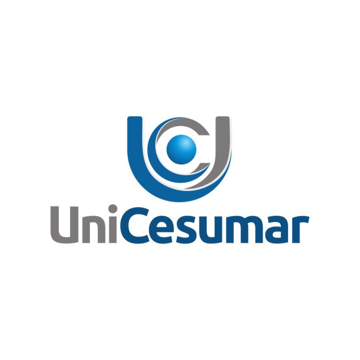

# Sistema Educacional Unicesumar



## 📋 Descrição

O Sistema Educacional Unicesumar é uma plataforma integrada para gestão acadêmica e acompanhamento de desempenho, desenvolvida com Streamlit. A aplicação permite gerenciar tarefas educacionais, analisar o desempenho de alunos, gerar recomendações personalizadas usando IA e administrar um banco de dados SQLite para persistência de dados.

Este projeto foi desenvolvido como parte de um Trabalho de Conclusão de Curso (TCC) e demonstra a aplicação de tecnologias modernas para o ambiente educacional.

## ✨ Recursos Principais

- 📝 **Gerenciador de Tarefas**: Organize atividades acadêmicas, defina prazos e monitore progresso
- 👨‍🎓 **Controle de Alunos**: Gerencie informações, notas e frequência dos alunos
- 📊 **Análise de Desempenho**: Visualize gráficos e estatísticas detalhadas sobre desempenho acadêmico
- 🧠 **Recomendações Personalizadas**: Receba sugestões de estudo personalizadas via IA (DeepSeek)
- 🔄 **Banco de Dados SQLite**: Armazenamento persistente com backup e restauração

## 🛠️ Tecnologias Utilizadas

- **Streamlit**: Framework para criação da interface web
- **Pandas & NumPy**: Análise e manipulação de dados
- **Plotly**: Visualizações gráficas interativas
- **SQLite**: Banco de dados relacional para persistência
- **DeepSeek (via OpenRouter)**: API de IA para recomendações personalizadas

## 📦 Requisitos

- Python 3.8+
- Pip (gerenciador de pacotes do Python)
- Acesso à internet (para recursos de IA)

## 🚀 Instalação

1. Clone este repositório:
   ```bash
   git clone https://github.com/seu-usuario/sistema-educacional-unicesumar.git
   cd sistema-educacional-unicesumar
   ```

2. Crie e ative um ambiente virtual (recomendado):
   ```bash
   # No Windows
   python -m venv venv
   venv\Scripts\activate

   # No macOS/Linux
   python3 -m venv venv
   source venv/bin/activate
   ```

3. Instale as dependências:
   ```bash
   pip install -r requirements.txt
   ```

4. Prepare o arquivo de configuração (opcional):
   - Para usar recursos de IA, obtenha uma chave API do [OpenRouter](https://openrouter.ai/)
   - Crie uma pasta `.streamlit` na raiz do projeto
   - Crie um arquivo `secrets.toml` dentro da pasta `.streamlit` com o seguinte conteúdo:
     ```toml
     DEEPSEEK_API_KEY = "sua-chave-api-aqui"
     ```

## 🖥️ Executando a Aplicação

Execute o comando abaixo na raiz do projeto:

```bash
streamlit run "🏠Página Inicial.py"
```

O navegador abrirá automaticamente com a aplicação em execução. Se não abrir, acesse o endereço mostrado no terminal (geralmente http://localhost:8501).

## 📂 Estrutura do Projeto

```
sistema-educacional-unicesumar/
├── 🏠Página Inicial.py        # Página principal da aplicação
├── utils.py                   # Funções auxiliares
├── assets/                    # Imagens e recursos visuais
│   └── logo_uni_v2.jpg        # Logo da Unicesumar
├── pages/                     # Módulos da aplicação
│   ├── 1_📝Tarefas.py         # Gerenciador de tarefas
│   ├── 2_👨‍🎓Alunos.py         # Controle de alunos e desempenho
│   ├── 3_🧠Recomendacoes_Personalizadas.py  # Recomendações via IA
│   ├── 4_⚙️Configuracoes.py    # Configurações da aplicação
│   └── 5_🔄_DB_Admin.py        # Administração do banco de dados
├── data/                      # Pasta para armazenar o banco de dados SQLite (criada automaticamente)
│   └── tarefas.db             # Banco de dados SQLite
└── backups/                   # Armazena backups do banco de dados (criada automaticamente)
```

## 🚶‍♀️ Tour pela Aplicação

### Página Inicial
Apresenta as principais funcionalidades do sistema e fornece acesso rápido a todos os módulos através do menu lateral.

### Gerenciador de Tarefas
- Adicione, edite e exclua tarefas
- Defina categorias, prioridades e datas
- Visualize em modo lista ou calendário
- Adicione observações às tarefas
- Filtre por status, data e categorias

### Controle de Alunos
- Gerencie dados dos alunos
- Acompanhe desempenho com visualizações gráficas
- Analise notas por disciplina
- Compare desempenho individual e da turma

### Recomendações Personalizadas
- Receba sugestões de estudo personalizadas via IA
- Carregue dados de desempenho para análise
- Obtenha planos de estudo adaptados a cada aluno
- Configure conteúdo programático e estilos de aprendizagem

### Configurações
- Personalize a interface
- Configure chaves de API para serviços externos
- Ajuste preferências do sistema

### Administração do Banco de Dados
- Visualize dados armazenados
- Crie e restaure backups
- Otimize o banco de dados
- Gerencie arquivos de backup

## 📊 Uso do Banco de Dados

O sistema utiliza SQLite para armazenar as tarefas educacionais. O banco é inicializado automaticamente ao executar a aplicação. A página de Administração do Banco de Dados permite realizar operações como:

- Backup completo dos dados
- Restauração a partir de backups anteriores
- Otimização para melhor desempenho
- Visualização dos dados armazenados
- Monitoramento de estatísticas básicas

## ⚠️ Observações Importantes

- As chaves de API para serviços de IA são armazenadas em `secrets.toml` e não devem ser compartilhadas publicamente
- Recomenda-se realizar backups regulares do banco de dados, especialmente antes de atualizações
- A aplicação cria automaticamente as pastas `data/` e `backups/` para armazenamento

## 🤝 Contribuições

Contribuições são bem-vindas! Sinta-se à vontade para enviar pull requests com melhorias, correções ou novas funcionalidades.

## 📄 Licença

Este projeto está licenciado sob a licença MIT - veja o arquivo LICENSE para detalhes.

## 👩‍💻 Autora

Desenvolvido por Yasmim Merklein como parte do Trabalho de Conclusão de Curso na Unicesumar.

---

**Nota**: Para utilizar os recursos de IA, é necessário configurar uma chave API válida do OpenRouter. Na página de Configurações do sistema, você pode inserir sua chave de API para habilitar as recomendações personalizadas. 
